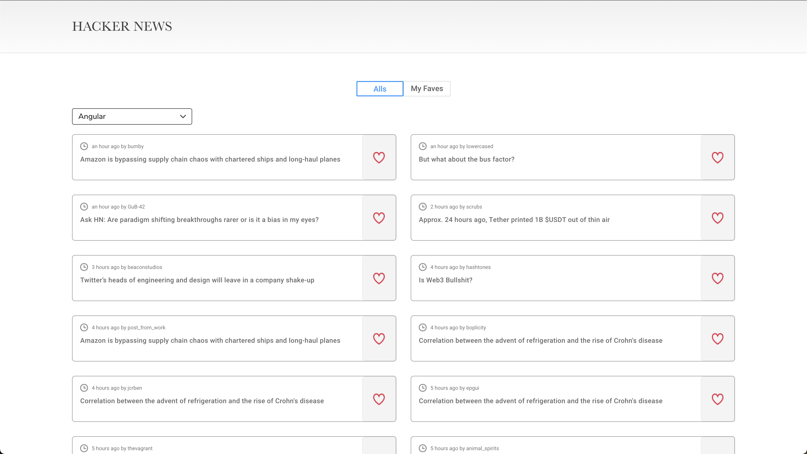

# Front End Developer (Hackers News)

This project is developed for a technical test.

## FUNCTIONALITY

- The selected filter should persist on the local storage
- The favorited posts should persist on the local storage
- The web app is expected to work as a responsive web application
- When clicking on the row, a new tab should be open with the link of the post
  (story_url)
- Clicking on the “like button” should not trigger the opening of the post URL link
- When hovering on the row, apply opacity to the entire row and its children (texts,
  icons, like button, etc)
- Pagination as infinite scroll

## Demo

Application deployed in Netlify

https://hacker-news-bc.netlify.app/

## Usage

- Open a terminal.
- Clone the repository locally as follow:
  - `git clone https://github.com/BrangyCastro/hacker-news.git`
- Go to the project folder:
  - `cd /hacker-news`
- Install the project packages:
  - `npm install`
- Run the project:
  - `npm run start`
- Run tests:
  - `npm run test`
- Open the application on your browser:
  - [Localhost](http://localhost:3000/)

## Technologies:

- API: [Hackers News public API.](https://hn.algolia.com/api/v1/search_by_date?query=angular&page=0)
- FrontEnd:
  - UI: ReactJS.
- Testing:
  - Jest.
  - Enzyme.

## Author

🇪🇨 **Brangy Castro** [Sitio Web](https://brangycastro.netlify.app/)

[GitHub](https://github.com/BrangyCastro)
[Linkedin](https://www.linkedin.com/in/brangycastro/)
[Twitter](https://twitter.com/BrangyC)
[Facebook](https://www.facebook.com/brangy.castro/)
[Behance](https://www.behance.net/brangycastro)
[Dribbble](https://dribbble.com/BrangyC)
